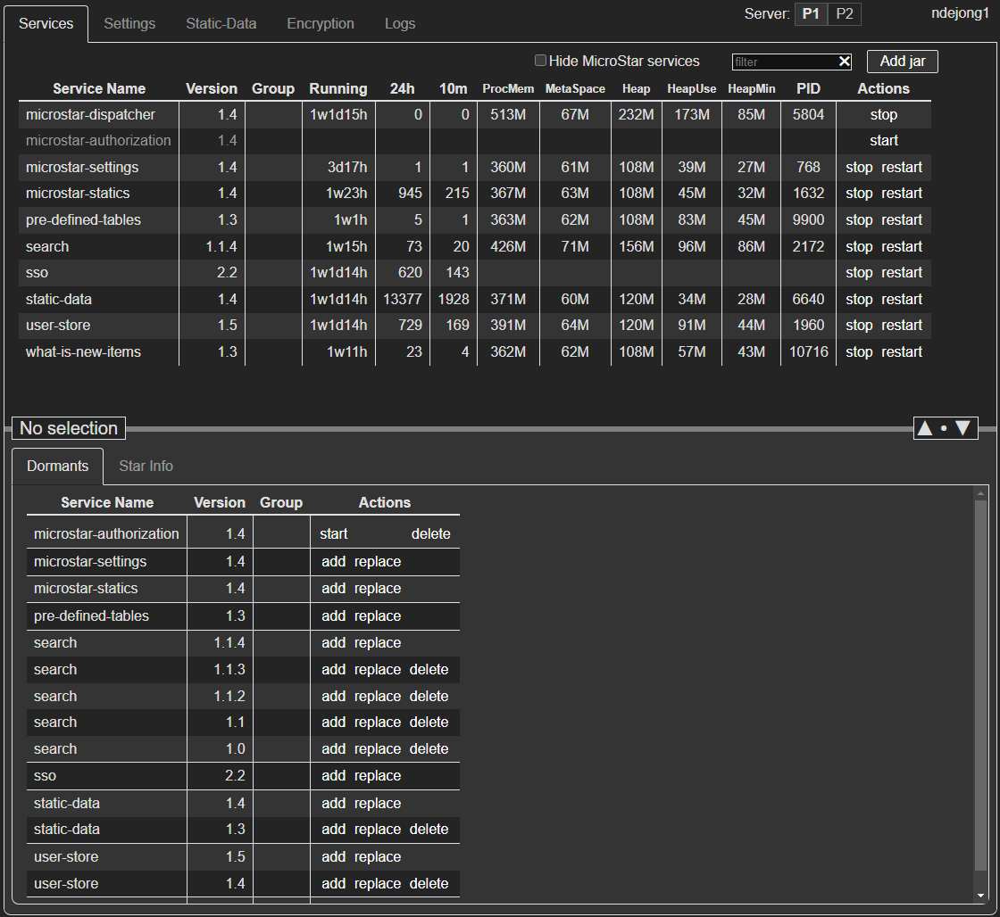

# MicroStar

A simple microservice platform based on Spring components that
uses a single gateway (Dispatcher) that connects all services.

Features:
- Convention over configuration
- Zero-conf deployment
- Its own spring-cloud-config [alternative](doc/CLOUD_CONFIG.md)
  that supports immediate updates the moment a settings file is updated
  without restarting services
- Supports running in multi-node mode, so multiple stars e.g. behind a load-balancer
- Supports running multiple microservice-versions at the same time
- Supports running multiple instances of the same service
- Each service (version) has its own log-file without needing to configure
- Administrator interface for service start/stop, settings, logging, encryption
  See more [screenshots](doc/dashboard/DASHBOARD.md)



## Limitations

- Services using MicroStar needs to include some MicroStar code (and so become dependent)
- Dispatcher should be able to call the microservices
- Dispatcher should be able to call other dispatchers when running in multi-node mode
  (see the P1/P2 button in the screenshot above: behind a load-balancer requests to P1 can
  go via P2 or vice versa as the load-balancer doesn't know where a request should go)

## How to add an existing service

For an existing Spring Boot service to connect to the Dispatcher and handle settings
sent by MicroStar the main class should be slightly altered from:

```Java
@SpringBootApplication
@ConfigurationPropertiesScan
public class MyApplication {
    public static void main(String... args) {
        SpringApplication.run(MyApplication.class, args);
    }
}
```
to
```Java
@SpringBootApplication
@ConfigurationPropertiesScan
@ComponentScan(basePackageClasses = {MyApplication.class, MicrostarSpringWebflux.class})
public class MyApplication extends MicroStarApplication {
    public static void main(String... args) {
        start(MyApplication.class, args);
    }
}
```
(or `MicrostarSpringMvc.class` if it is an MVC service)

The service should know where the Dispatcher is running: `app.config.dispatcher.url=http://<host>:<port>`
which should be provided in the application.yaml or on the command line using the `-Dapp.config.dispatcher.url=...`

To support dynamic settings, the property classes should look something like this:

```Java
@DynamicProperties("my-properties")
@Jacksonized @Builder
public final class MyProperties {
    public final Environment environment;
    public final List<String> moreValues;

    @Jacksonized @Builder
    public static final class Environment {
        @Default public final String someEnvField = "value";
        @Default public final String otherEnvField = "otherValue";
    }
}
```
and can be used in a class by this:
```Java
@Slf4j
@Component
public class MyService {
    private static final DynamicPropertiesRef<MyProperties> propsRef = DynamicPropertiesRef.of(MyProperties.class)
        .onChange(props -> {
          log.info("Props changed. moreValues: {}", props.moreValues);
        })
        .callOnChangeHandlers();
    
    void someMethod() {
        log.info("Value of someEnvField is {}", propsRef.get().environment.someEnvField);
    }
}
```

## Project Structure

- microstar-common: generic independent utility functionality
- microstar-spring: utility functionality that is spring related
  - microstar-spring-mvc: for services that use mvc
  - microstar-spring-webflux: for services that use webflux
- microstar-services: contains the individual microservices
  - microstar-dispatcher: gateway to the star
  - microstar-authorization: returns a secure token
  - microstar-reflector: debug microservice that returns a request as text
  - microstar-settings: keeps app configuration files
  - microstar-statics: serves static content (e.g. frontend) and
    proxies configured locations (e.g. local node-server)

See [HOWTO](doc/HOWTO.md) on how to start all this
(in short: `mvn clean install` and `./start.sh`).

## Dispatcher

Gateway and services administration.

- **Gateway**: proxies requests to the correct microservice
- When a service starts it registers itself with the Dispatcher.
  A service has the location & port of the Dispatcher configured.
- Keeps list of running microservices
- **Starts/Stops jars**: when a request is received to a
  jar that is not running, starts it. When a jar is not
  accessed for a long time, stops it. Typical for jars
  of feature branches that need to be tested / accepted.
- **Deletes jars**: when a jar is not started for a long
  while, the Dispatcher will delete it. Typical for jars
  of feature branches that need to be tested / accepted.

## Microservice jar naming

This system is able to run multiple versions of the product
consecutively. One or more microservice instances may be
added for a branch while the same service keeps running
for another branch. The naming of the jar tells the
Dispatcher what group (branch) the service is part of.

The name of a microservice jar should be:

[serviceGroup_]serviceName[-timestamp and or version].jar

- this is called: serviceId
- **serviceGroup**: Name of the group/branch/story the
  microservice exists for. If not provided, 'main' is
  assumed. 'main' is the current product version.
- **serviceName**: Name of the service
- **timestamp**: a datetime in the form yyyyMMddhhmmss
  (0 if omitted)
- **version**: a version in the form major.minor.patch
- timestamp and version will be sorted semantically
  (meaning '9.1.0' is before '10.1.0') so the Dispatcher
  knows what is the newest.

Multiple microservices with the same name can exist.
When microservices have the same group and name the one
with the highest timestamp will be used.

The serviceGroup is part of the url when calling the
Dispatcher. The url should be in the form /group/serviceId
where group will be 'main' when omitted.

Microservices should only call each other via the Dispatcher.
When microservices call each other the Dispatcher will
make sure the same group is used. If the called microservice
does not exist for its group, the one from the main group
will be used.

An example. When these microservices exist:
- main_database-1
- main_database-3
- story1234_database-2

these calls will lead to calling:
- /database -> main_database-3 (other is older)
- /story1234/database -> story1234_database-2 (group story1234)

In the code there are distinctions between:
- **ServiceId** being group-serviceName-version
- **ServiceInstanceId** a UUID referring to a specific service instance

## Settings

Please don't use @Value as that is not compatible with reloaded
settings and has issues with non-string values. Use
DynamicProperties instead. See the
[CLOUD-CONFIG documentation](doc/CLOUD_CONFIG.md)

The dashboard has a 'settings' tab where settings files can be
created and edited.

## Authentication / authorisation

Every service needs a clusterSecret key that allows them to
communicate and register with the Dispatcher. Any other callers
don't have this secret and should authenticate themselves.

The front-end client should call the Authorization microservice to
obtain a secure token which contains the id and name of the user.
User rights are configured in the settings. Calling the microservices
should include this token in the http-header. Omission will lead to
a 401 (not authenticated) being returned. Calls for which
the user has no rights (like altering the database) will also
result in a 401.

## Deployed directory setup

    MicroStar +
        + *.jar
        + log
            + {serviceName}/...
        + data
            + {serviceName}
               + service specific data

## Details

Separate documents exist with more details:

- [FAQ](doc/FAQ.md)
- [HOWTO](doc/HOWTO.md)
- [Coding rules](doc/RULES.md)
- [Technical debt](doc/DEBT.md)
- [Security and encryption](doc/SECURITY.md)
- [TODO](doc/TODO.md)
